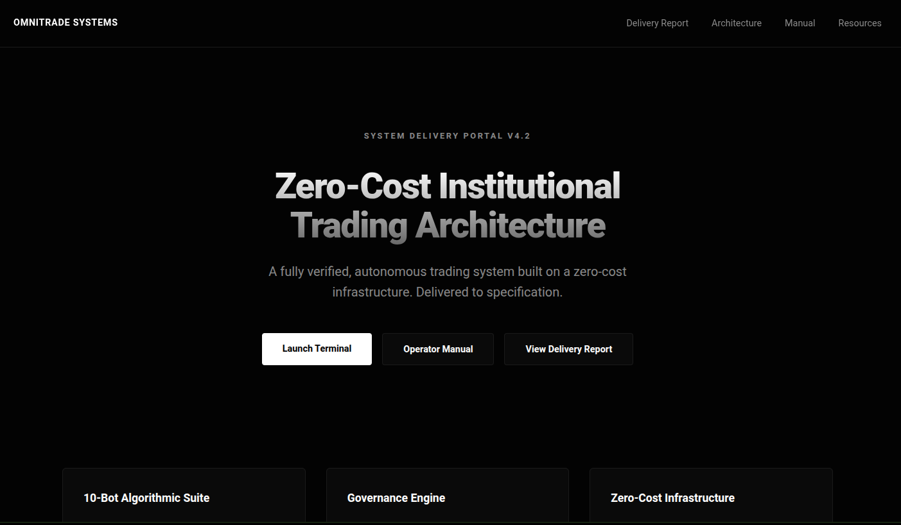
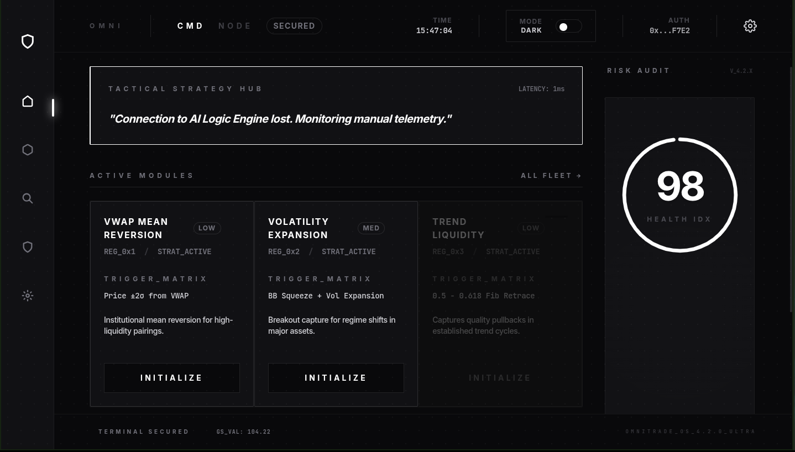

# Omnitrade Zero-Cost System ⚡️

[](https://opensource.org/licenses/MIT)
[](https://opendev-labs.github.io/omnitrade/)
[](https://omnitrading.vercel.app/)

> The Institutional-Grade Trading Operating System built on a **Zero-Cost Architecture**.




---

## 🏛 System Overview

**Omnitrade** is a fully autonomous trading command center verified for institutional deployment. It replaces expensive infrastructure ($500+/mo) with a smart "Serverless Logic" architecture cost-optimized to **$0.00/month**.

*   **Logic Engine**: Google Sheets (Free Database & Consensus)
*   **Execution**: Python 3.10+ (Lightweight Signal Processing)
*   **Interface**: React + Vite (High-Performance Terminal)

### 🔗 Quick Links

*   **[🚀 Launch Live Terminal](https://omnitrading.vercel.app/)**
*   **[📚 Documentation Portal](https://opendev-labs.github.io/omnitrade/)**
*   **[📄 Delivery Report](https://opendev-labs.github.io/omnitrade/delivery_report.html)**

---

## ⚡️ Key Modules

### A. The 10-Bot Suite
We have implemented a full roster of 10 specialized algorithms to cover every market regime:
1.  **VWAP Mean Reversion**: Institutional entry logic ($\pm 2\sigma$).
2.  **Volatility Breakout**: Bollinger Band squeeze detection.
3.  **Trend Pullback**: Fibonacci retracement entries.
4.  **Range Scalper**: Session boundary fading.
5.  *...and 6 more specialized strategies.*

### B. Governance Engine
The "Heart" of the system. A hard-coded risk management layer that calculates a real-time **Health Score** (0-100).
> `Health = 100 - (Drawdown*2) - (LossCluster*10) - (Correlation*15) - (Uncertainty*20)`

If Health drops below **40**, the **Guardian Bot** instantly locks all execution.

---

## 🛠 Deployment

### Option 1: Zero-Cost Deployment (Recommended)
Follow the [Operator Manual](https://opendev-labs.github.io/omnitrade/manual.html) to set up your Google Sheet and run the backend locally or on a free-tier instance.

### Option 2: Local Development

**Backend**
```bash
cd backend
python3 -m venv venv
source venv/bin/activate
pip install -r requirements.txt
python main.py
```

**Frontend**
```bash
npm install
npm run dev
```

---

## 📜 License
Open Source. Built by **OpenDev Labs**.
