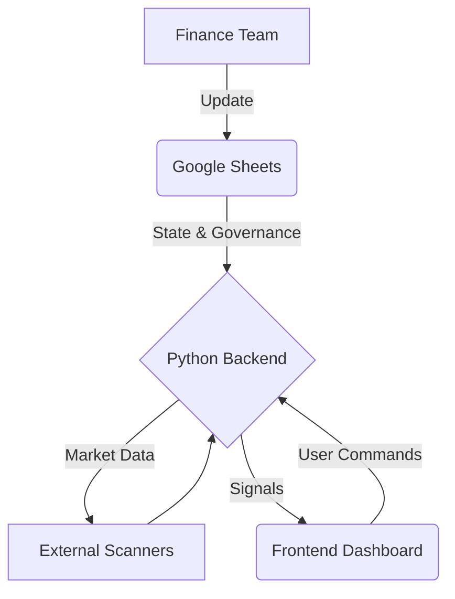

# System Architecture

**Overview:** The Omnitrade architecture is designed for **Zero-Cost Operation** without sacrificing institutional capabilities. It leverages a "Serverless Logic" approach where the brain of the system resides in Google Sheets, while execution is handled by a lightweight Python backend.

## 1. The Core Engine (Google Sheets)
The database is replaced by Google Sheets to remove hosting costs and enable non-technical interactions.
*   **Market State**: Defines the global regime (Trend/Range/Vol).
*   **Health Score**: Defines the risk tolerance (0-100).
*   **Permissions**: A detailed matrix of allowed bots per regime.

## 2. Backend Logic (Python/FastAPI)
A lightweight logic layer (`/backend`) acts as the bridge.
*   **Sheets Service**: Periodic polling of the Sheet for state changes.
*   **Bot Logic**: Pure Python implementation of the 10 algorithms.
*   **Scanners**: Mockable data ingestion for price action analysis.

## 3. Frontend Experience (React/Vite)
A high-performance "Terminal" interface deployed on Vercel.
*   **Tech Stack**: React, TypeScript, TailwindCSS.
*   **Features**: Real-time state visualization, WebSocket connectivity, Institutional UI components (Health Circle, Dark Mode).

## 4. Zero-Cost Infrastructure
*   **Hosting**: Vercel (Free Tier)
*   **Database**: Google Sheets (Free)
*   **Compute**: Local Run or Free Tier functionality (e.g. Render/Railway).
